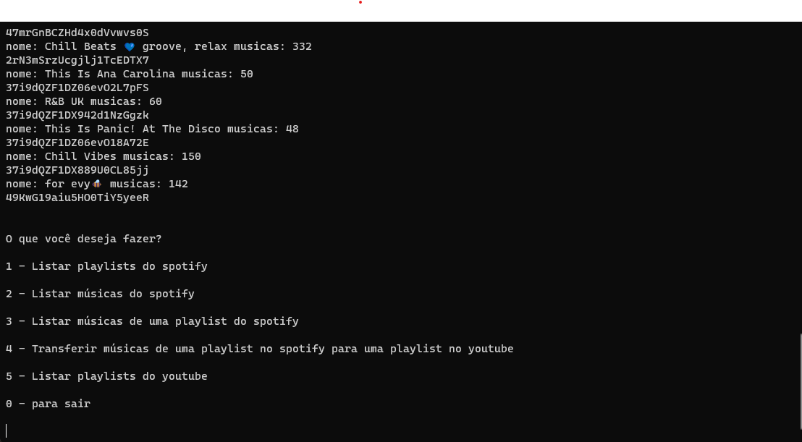

# Spotify para Youtube
> Ainda em desenvolvimento.
> Um script feito para transferir as músicas do spotify para o youtube. Originalmente seriam apenas as músicas curtidas, mas será possível transferir playlists específicas também e criar playlists novas.
> > Link para ver [em funcionamento](https://clipchamp.com/watch/Un6MNQNL160)


## Pré-Requisitos

1 - Você deve ter o python versão 3.11 ou posterior instalado na sua máquina

2 - Você deve configurar uma API na sua conta do spotify ([Link de apoio](https://developer.spotify.com/documentation/web-api))

3 - Você deve configurar também sua API do Youtube no painel do google ([Link de apoio](https://developers.google.com/youtube/v3/getting-started?hl=pt-br))

3.1 Após configurar a API do youtube, faça o download do arquivo .json que contém suas credenciais, renomeie o mesmo para "client_secret.json" e o cole na raiz do projeto.

## Variáveis de ambiente necessárias

- No arquivo settings.py altere as seguintes variáveis para os valores fornecidos pela sua API do spotify:
```.env
YOUR_SPOTIFY_CLIENT_ID
YOUR_SPOTIFY_SECRET_KEY
```
## Rodando localmente

Crie um ambiente virtual no qual o projeto será clonado e em seguida clone o mesmo:
```bash
git clone git@github.com:Evylla/spotify_to_youtube.git
```
Não se esqueça de instalar os requerimentos com:
```bash
pip install -r requirements.txt
```
Em seguida, após completar todos os passos, rode:
```bash
python3 .\main.py
```
